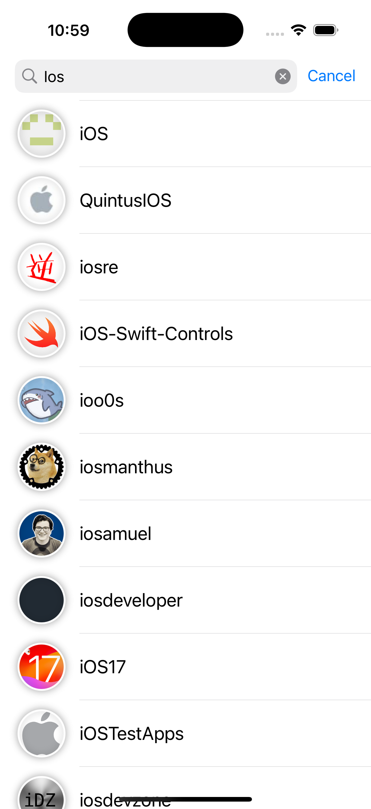
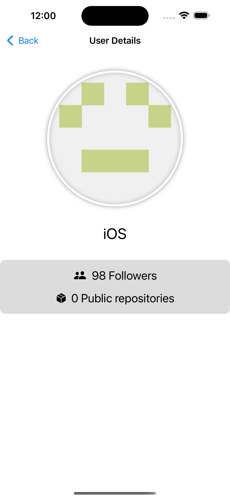
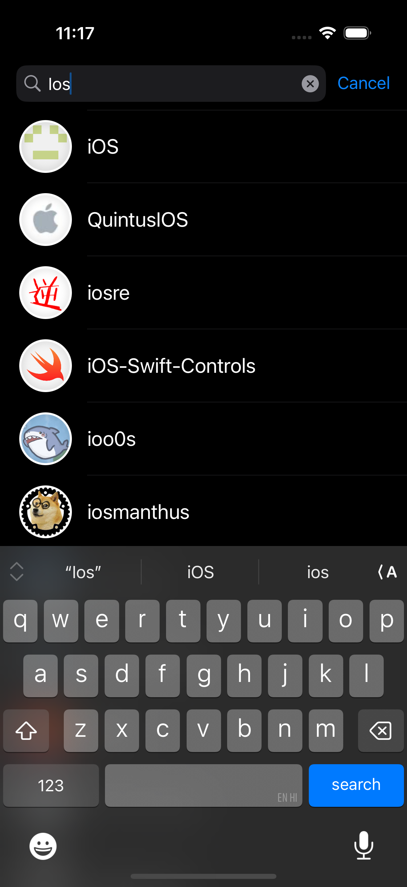
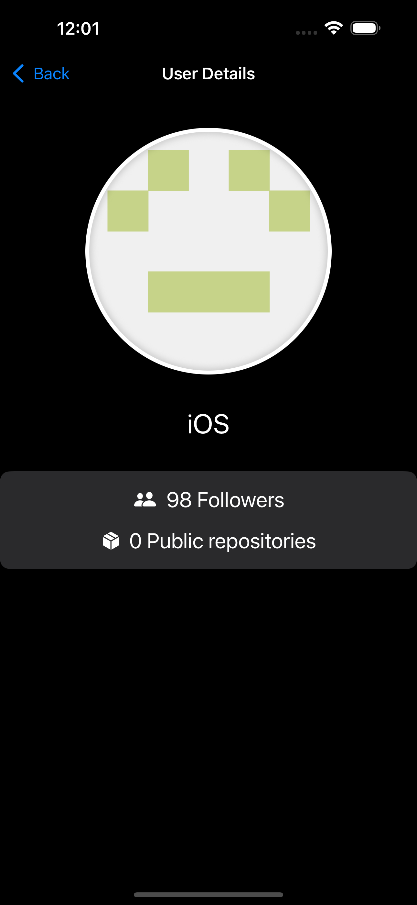

# GitHubDemo

  SwiftUI app for searching GitHub users, built with MVVM + Coordinators architecture.
  Git history included (created local repository)
  minimum iOS version: iOS 16

  ## Why MVVM + Coordinator for SwiftUI?

  - Coordinators handle navigation, 
  - ViewModels manage `@Published` state for reactive UI updates, 
  - Views stay declarative and testable.

  ## Packages

  - **NetworkKit** - Generic HTTP networking layer
  - **UserDetailsDomainLayer** - Repository pattern
  - **UsersUILayer** - SwiftUI views, ViewModels, ViewControllers for UIKit navigation, and navigation coordinator
  - **UIUtilities** - Shared protocols and accessibility identifiers

  ## Testing

  1. Unit Tests
  2. Integration Tests
  3. UI Tests

  ## Screenshots
    ### Light Mode
   

  ### Dark Mode
   
